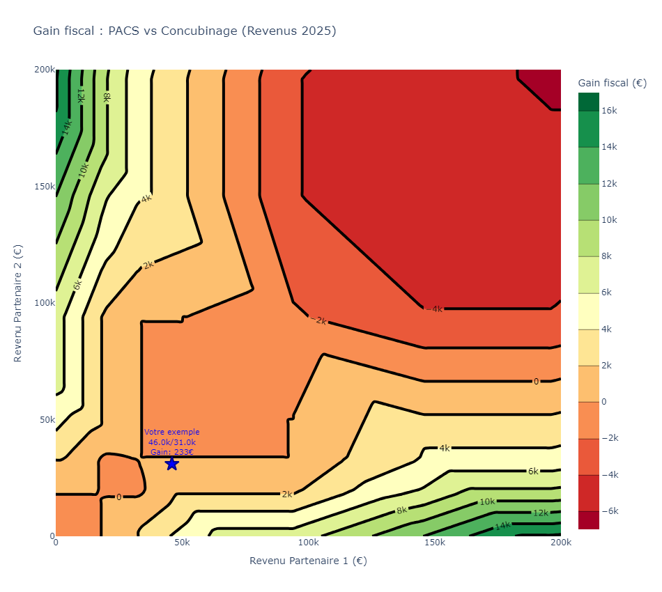

# PACS vs concubinage : quand l'avantage fiscal sur l'impôt sur le revenu disparaît

> Modélisation et visualisation de l'écart d'impôt sur le revenu (IR) français entre un couple **pacsé/marié** (déclaration commune) et un couple **en concubinage** (deux déclarations séparées), en fonction des revenus des deux partenaires.

**Question de recherche :** le PACS est souvent présenté comme avantageux fiscalement. Pour quels couples l'est-il réellement, et dans quels cas coûte-t-il plus cher que le concubinage ?



---

## Résultats principaux

Sur une grille de revenus de 0 à 200 000 € par partenaire (pas de 2 000 €) :

- **Revenus égaux : aucun gain.** Sur la diagonale (revenu 1 = revenu 2), le PACS ne fait jamais économiser d'impôt, car le quotient conjugal ne lisse rien quand les deux revenus sont identiques.
- **Le gain vient de l'écart de revenus.** Plus l'écart est grand, plus le quotient conjugal profite au couple pacsé (jusqu'à plusieurs milliers d'euros par an).
- **Une zone où le PACS coûte plus cher** : lorsque les deux partenaires ont chacun un revenu d'environ 20 000 à 32 000 €, le couple pacsé paie **jusqu'à 311 € de plus** que s'il restait en concubinage.
- **Cause : la décote.** Deux concubins bénéficient de deux forfaits individuels (2 × 897 € = 1 794 €), un couple pacsé d'un seul forfait couple (1 483 €), soit 311 € d'écart.
- Exemple chiffré : 31 200 € / 18 000 € de revenus annuels donnent **149 € de surcoût** pour le couple pacsé.

> Ces chiffres sont à mettre à jour avec ta propre exécution du code final (voir *Reproductibilité*).

---

## Méthode

Modèle simplifié de l'IR sur les **revenus 2025 (déclaration 2026)**, appliqué à des salaires.

| Étape | Règle utilisée |
|---|---|
| 1. Déduction forfaitaire de 10 % | 10 % du salaire, avec un plancher et un plafond **par personne** (509 € / 14 555 €) |
| 2. Quotient conjugal | Revenu imposable du foyer divisé par le nombre de parts (1 pour un célibataire, 2 pour un couple) |
| 3. Barème progressif | 0 % jusqu'à 11 600 €, 11 % jusqu'à 29 579 €, 30 % jusqu'à 84 577 €, 41 % jusqu'à 181 917 €, 45 % au-delà (par part) |
| 4. Décote | Forfait de 897 € (personne seule) ou 1 483 € (couple), moins 45,25 % de l'impôt brut, **limitée à zéro** |
| 5. Impôt net | Impôt brut moins décote, **jamais négatif** |

**Concubinage** : `impôt(revenu 1) + impôt(revenu 2)`, chacun avec 1 part.
**PACS** : un seul impôt sur le revenu cumulé du foyer, avec 2 parts.
**Gain du PACS** = impôt concubinage − impôt pacsé (positif : le PACS fait économiser).

### Hypothèses et limites

Ce projet est **pédagogique**. Il ne remplace ni un simulateur officiel ni l'avis d'un fiscaliste.

- Couple **sans enfant**, deux salariés, sans autre revenu (foncier, capitaux, indépendants)
- Revenu saisi = **salaire net imposable annuel**, avant déduction forfaitaire de 10 %
- Pas de réductions ni de crédits d'impôt, pas de frais réels
- Pas de prise en compte des autres effets du PACS (succession, protection du conjoint, prestations sociales, prime d'activité)
- Pas d'arrondis intermédiaires comme dans le calcul officiel : écarts de quelques euros possibles
- Année de conclusion du PACS (option pour des déclarations séparées) non modélisée

---

## Structure du dépôt

```
.
├── README.md
├── requirements.txt
├── src/
│   └── ir_model.py          # barème, décote, impôt individuel et couple
├── notebooks/
│   └── analyse_pacs_ir.ipynb  # analyse et visualisations
├── tests/
│   └── test_ir_model.py     # cas de référence (impôt >= 0, cohérence, exemples)
└── figures/
    └── heatmap_gain_pacs.png
```

## Installation et utilisation

```bash
git clone https://github.com/<ton-compte>/<ton-repo>.git
cd <ton-repo>
python -m venv .venv && source .venv/bin/activate
pip install -r requirements.txt
jupyter notebook notebooks/analyse_pacs_ir.ipynb
```

Dépendances principales : `numpy`, `plotly`, `matplotlib`, `jupyter`.

## Reproductibilité

Tous les paramètres fiscaux (tranches, plancher et plafond de la déduction de 10 %, forfaits de décote) sont regroupés en tête de `src/ir_model.py` : pour une autre année, il suffit de les mettre à jour. Les figures du README sont générées par le notebook.

## Sources

- Barème de l'impôt sur le revenu 2026 (revenus 2025) : loi de finances pour 2026, [impots.gouv.fr](https://www.impots.gouv.fr)
- Décote : article 197 du Code général des impôts
- Déduction forfaitaire de 10 % : article 83 du Code général des impôts, montants publiés au BOFiP (BOI-BAREME-000035)
- Historique des paramètres : [Institut des politiques publiques (barèmes IPP)](https://www.ipp.eu/baremes-ipp/)

## Avertissement

Je ne suis pas fiscaliste. Les résultats sont des estimations issues d'un modèle volontairement simplifié et ne constituent pas un conseil fiscal. Pour votre situation, utilisez le simulateur officiel de impots.gouv.fr.

## Auteur

**Théo CONDAMIN**, double compétence finance et data. Contributions, remarques et corrections de fiscalistes bienvenues via les *issues*.